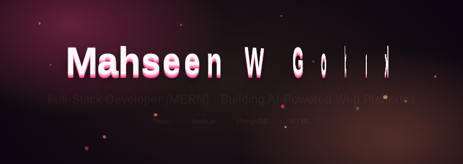
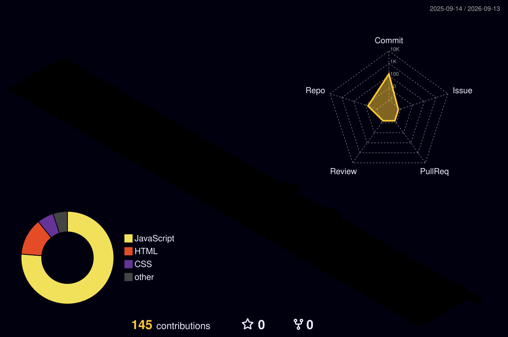

<p align="center">
  
</p>

<p align="center">
  <a href="https://www.linkedin.com/in/mahseen-w-gokak-5476342bb/"></a>
  <a href="mailto:mahseengokak56@gmail.com"></a>
  <a href="https://portfolio-one-sigma-ux44gmecwp.vercel.app"></a>
  <a href="https://github.com/mahseengokak56-eng?tab=repositories"></a>
</p>

<br />

## `01 // SYSTEM PROFILE`

```js
const mahseen = {
  role: "Full-Stack Developer (MERN)",
  degree: "B.E. Computer Science & Engineering",
  location: "Karnataka, India 🇮🇳",
  currentQuest: ["AI/ML fundamentals", "LangChain", "prompt engineering"],
  buildZones: ["AI-powered platforms", "mental-health tech", "full-stack web apps"],
  status: "Open to SDE internships & freelance work",
};
```

I'm a computer science engineering student (graduating 2027) who'd rather ship something real than just study it — five deployed projects back that up, from an AI study assistant to a burnout-prediction platform for students.

> **Currently:** sharpening AI/ML fundamentals (IBM, Coursera, IBM SkillsBuild) alongside core software engineering — trying to understand both how to build a product and why the model behind it works.

<br />

## `02 // SELECTED BUILDS`

<table width="100%">
<tr>
<td width="50%" valign="top">

### 🧠 [MindMap AI](https://github.com/mahseengokak56-eng/MindMap-AI)
AI-powered mental health tracking and burnout-prediction platform, with mood tracking, a burnout-risk model, an AI recommendations engine, and an analytics dashboard.

`React 19` `Node/Express` `MongoDB` `JWT`

[Live ↗](https://mind-map-ai-zeta.vercel.app) · [Code ↗](https://github.com/mahseengokak56-eng/MindMap-AI)

</td>
<td width="50%" valign="top">

### 📚 [EduNova AI Study Bot](https://github.com/mahseengokak56-eng/study-bot-chatbot)
Hybrid ML + NLP study assistant with intent classification across five domains, secure auth, and optional LLM augmentation via Groq.

`Python` `NLP` `MongoDB` `Groq`

[Live ↗](https://study-bot-chatbot.vercel.app) · [Code ↗](https://github.com/mahseengokak56-eng/study-bot-chatbot)

</td>
</tr>
<tr>
<td width="50%" valign="top">

### 🩺 [Student Wellness Hub](https://github.com/mahseengokak56-eng/student-wellness-hub)
Responsive student wellness site with mental-health resources and practical stress-management guidance.

`React` `Responsive UI`

[Code ↗](https://github.com/mahseengokak56-eng/student-wellness-hub)

</td>
<td width="50%" valign="top">

### ⛓️ Axiom
Collaborative build — blockchain-based certificate verification using SHA-256 hashing and IPFS decentralized storage, with role-based auth and REST APIs.

`SHA-256` `IPFS` `REST APIs`

[Live ↗](https://axiom-frontend-neon.vercel.app)

</td>
</tr>
<tr>
<td width="50%" valign="top">

### 🛡️ HerShield
Collaborative build — a women's safety platform with SOS alerts, live location tracking, real-time rooms, and email/SMS integration.

`Firestore` `Real-time` `SOS Alerts`

[Live ↗](https://hershield-web.web.app)

</td>
<td width="50%" valign="top">

</td>
</tr>
</table>

<div align="center">
  <a href="https://github.com/mahseengokak56-eng?tab=repositories"></a>
</div>

<br />

## `03 // TECH CONSTELLATION`

<div align="center">


<br /><br />

`FRONTEND` **React · Tailwind CSS** &nbsp;·&nbsp; `BACKEND` **Node.js · Express · MongoDB** &nbsp;·&nbsp; `AI/ML` **Prompt Engineering · LangChain · basic NLP**

</div>

<br />

## `04 // CONTRIBUTION SKYLINE`

<div align="center">



<sub>A 3D isometric render of real commit activity, refreshed automatically.</sub>

</div>

<br />

## `05 // DEVELOPER TELEMETRY`

<div align="center">


<br />


</div>

<br />

## `06 // OPEN CHANNEL`

<div align="center">

I'm interested in **AI-powered products, full-stack builds, and internship or freelance opportunities where I can actually ship.**

If that sounds like your frequency, connect with me.

<br />

<a href="https://www.linkedin.com/in/mahseen-w-gokak-5476342bb/"></a>

<br /><br />


<sub><code>CODE × CURIOSITY × CONSISTENCY</code></sub>

</div>
